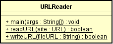
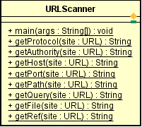
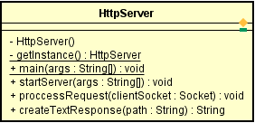
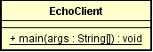
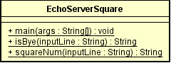
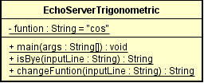
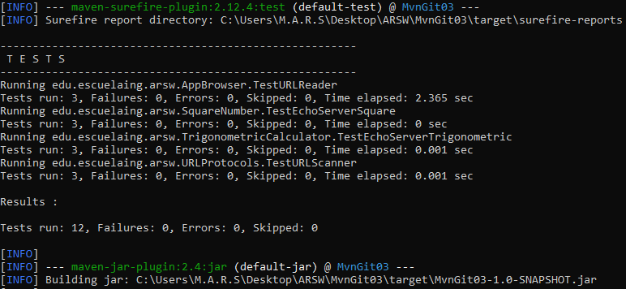

## Networking
### Miguel Ángel Rodríguez Siachoque
### 11 de Junio de 2021

## Ejecución de programas
- Los programas ___HttpServer, URLScanner y URLReader___ no necesitan ejecutar un ___EchoServer___ para su funcionamiento.
- Todos los programas exceptuando los anteriores nombrados, necesitan ejecutarse:
  1. Ejecutar ___EchoServer___ que quiere ejecutar.
  2. Ejecutar ___EchoCliente___ para poder ingresar entradas.
  3. Escribir entradas segun correspondan (Se explica a continuación).
- El programa ___EchoClient___ solamente se ejecuta, las entradas que se ingresan depende del servidor activado.

### Descripción de URLScanner.java
Este programa lee una URL a la cual se podra extraer y mostrar los protocolos de esta, en total 8 protocolos (getProtocol, getAuthority, getHost, getPort, getPath, getQuery, getFile, getRef)
#### Diagrama URLScanner.java
 
Este diagrama esta en el paquete ___edu.escuelaing.arws.URLProtocols___ con una clase, pues es de ejcución unica.
#### Ejecución
> 1. Ejecución del programa.
> 2. La entrada debe ser una URL.
> 3. La salida serán los 8 protocolos de la URL.

### Descripción de URLReader.java
Este programa lee el contenido de la URL y lo extrae archivando la información en un archivo con extensión .html .
#### Diagrama URLReader.java
 
Este diagrama esta en el paquete ___edu.escuelaing.arsw.AppBrowser___ con una clase, pues es de ejcución unica.
#### Ejecución
> 1. Ejecución del programa.
> 2. La entrada debe ser una URL.
> 3. La salida será un mensaje que explicará si el proceso a terminado.
> 4. El archivo resultado.html se guardará en la carpeta principal del proyecto.

### Descripción de HttpServer.java
Este es un programa que ejecuta un servidor HTTP en el cual se podran ejecutar diferentes archivos dentro de este.
#### Diagrama HttpServer.java
 
Este diagrama esta en el paquete ___edu.escuelaing.arws.HttpServer___ con una clase, pues es de ejcución unica.
#### Ejecución
> 1. Ejecución del programa.
> 2. Ingresará en su buscador preferido y pondrá la dirección: http://127.0.0.1:35000/ + El archivo que quiere visualizar.

### Descripción de EchoClient.java
Este programa crea un cliente el cual interactua con el servidor activo en ese momento.
#### Diagrama EchoClient.java
 
Este diagrama esta en el paquete ___edu.escuelaing.arws.Networking___ con una clase, pues es de ejcución unica.
#### Ejecución
> 1. Ejecución del programa.
> 2. Ejecución del Servidor.
> 3. La entrada y salida dependerá de las entradas y salidas de los servidores activos.

### Descripción de EchoServerSquare.java
Este es un programa en el cual se da el resultado del cuadrado del número asigando.
#### Diagrama EchoServerSquare.java
 
Este diagrama esta en el paquete ___edu.escuelaing.arws.SquareNumber___ con una clase, aunque necesita la ejecución de ___EchoClient.java___ no tienen un atributo en común.
#### Ejecución
> 1. Ejecución del programa.
> 2. Ejecución de ___EchoClient___.
> 3. La entrada puede ser un número ó terminar ___EchoServer___ con "Bye.".
> 4. La salida será el número cuadrado ó la despedida del servidor.

### Descripción de EchoServerTrigonometric.java
Este es un programa en el cual se ejecuta una calculadora triginometrica con las funciones de Seno, Coseno y Tangente.
#### Diagrama EchoServerTrigonometric.java
 
Este diagrama esta en el paquete ___edu.escuelaing.arws.TrigonometricCalculator___ con una clase, aunque necesita la ejecución de ___EchoClient.java___ no tienen un atributo en común.
#### Ejecución
> 1. Ejecución del programa.
> 2. Ejecución de ___EchoClient___.
> 3. La entrada puede ser un número, el cambio de la función ___(fun:cos, fun:sin, fun:tan)___, terminar ___EchoServer___ con "Bye.".
> 4. La salida será el resultado del número ó la despedida del servidor.

## Test
 
Se realizarón cuatro pruebas con mediante al comando: mvn test. 
> - Se realizaron 3 Pruebas por programa.
> - Las pruebas de HttpServer se verifican entrando en http://127.0.0.1:35000/TestHttpServer1.html, http://127.0.0.1:35000/TestHttpServer2.html ó http://127.0.0.1:35000/TestHttpServer3.html .

## JavaDoc:
[JavaDoc - Networking](JavaDocs/index.html)

## Tiempo de Lineas LOC: 
- ___El archvivo URLScanner.java:___ 
52 + 15(Test) = 67 lineasLOC. 
- ___El archvivo URLReader.java:___ 
102 + 15(Test) = 117 lineasLOC. 
- ___El archvivo HttpServer.java:___ 
33 + 36(Test) = 99 lineasLOC. 
- ___El archvivo EchoServerSquare.java:___ 
54 + 25(Test) = 79 lineasLOC. 
- ___El archvivo EchoServerTrigonometric.java:___ 
77 + 26(Test) = 103 lineasLOC.

### Tiempo total:

___465/14 = 33.21 lineasLOC/hora.___

